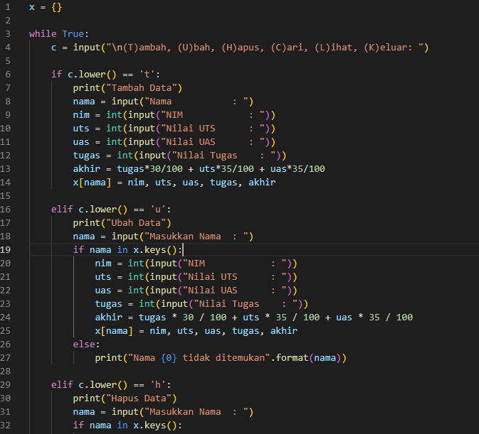
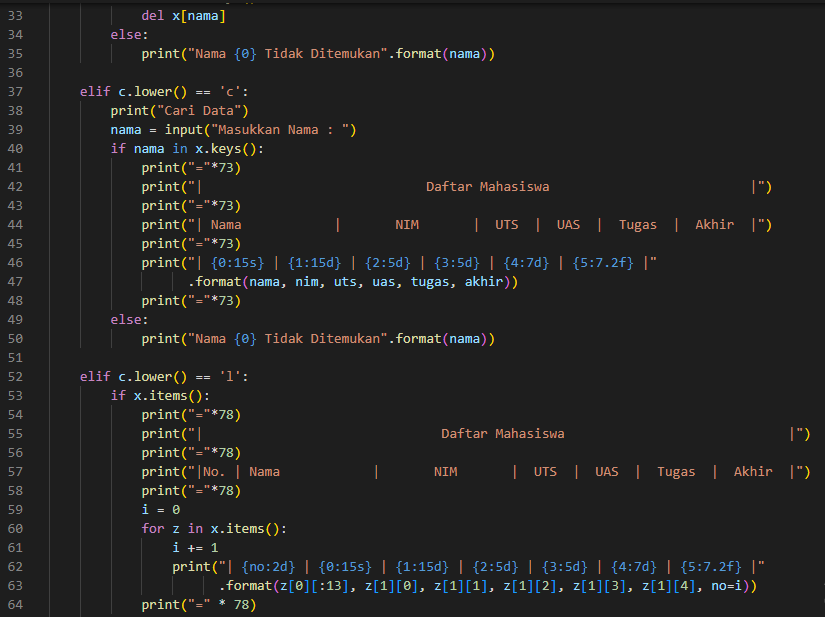
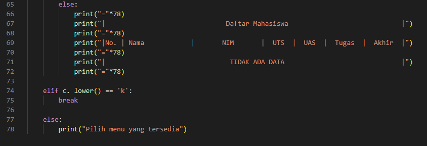

# Praktikum5.1
### Pada praktikum 5.1, kita akan membuat program untuk membuat data mahasiswa menggunakan Dictionary dengan python.
### 1. Pertama membuat sebuah dictionary kosong yang akan diinputkan data ketika program dijalankan yaitu x = {}.
### 2. Lalu kita membuat kondisi perulangan (while) dan sebuah keterangan untuk pilihan menu yang akan menjalankan program.
### 3. Setelah itu membuat beberapa kondisi (if) seperti Tambah data, Ubah data, Hapus data, Cari data, Lihat data dan Keluar.
### 4. "Tambah data". Apabila kita menginputkan 't' maka kita akan diminta untuk menginputkan beberapa data. Data yang kita inputkan akan masuk ke dictionary 'x' yang telah dibuat tadi dengan data 'nama' sebagai keys dan sisanya sebagai valuesnya.
### 5. "Ubah data". Apabila kita menginput 'u' maka akan ada keterangan untuk mengubah data dan kita akan diminta untuk menginputkan nama yang mau diubah datanya, apabila nama tidak ada maka outputnya "Nama {} tidak ditemukan". Dimana {} adalah nama/data yang mau kita ubah.
### 6. "Hapus data". Apabila kita menginput 'h' maka kita akan diminta menginput nama yang akan dihapus. Jika nama ada di dalam dictionary, maka system akan menghapus keys/nama tersebut beserta valuesnya pada statement del x[nama].
### 7. "Cari data". Apabila kita menginputkan 'c' maka kita akan diminta untuk memasukkan nama yang akan dicari. Apabila nama yang dicari ada di dalam dictionary maka outputnya akan menampilkan data dari nama tersebut.
### 8. "Lihat data". Apabila kita menginput 'l' maka sistem akan menampilkan data - data yang sudah kita masukkan. Jika kita belum memasukkan data maka outputnya menjadi "TIDAK ADA DATA".
### 9. "Keluar". Apabila kita menginput 'k' maka program akan langsung berhenti.
### 10. Jika menginputkan selain (t,u,h,c,l,k) makan akan diminta untuk memilih menu yang tersedia.
### Berikut Codingan Praktikum5.1
 
 
 
### Berikut Tampilan Program Saat Dijalankan
 
 
 

SELESAI
